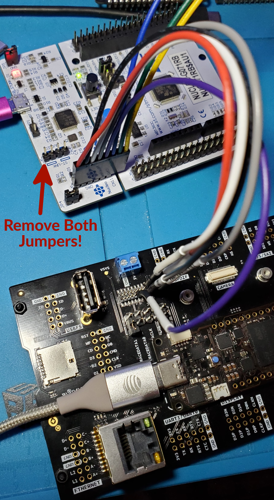

# portenta-tools
Build and debug tools for Arduino Portenta H7

## Build Mbed Core with Debug Symbols for Portenta H7

First, make sure you have the necessary prerequisites for the Mbed toolchain. On Ubuntu, you can use:

```sh
sudo apt install python3 python3-pip git mercurial gcc-arm-none-eabi
python3 -m pip install --user mbed-cli
```

Clone this repository, which includes changes to enable debug builds and various `mbed-os` source patches:

```sh
git clone --recurse-submodules https://github.com/ardnew/portenta-tools
```

Install all of the necessary dependencies:

```sh
python3 -m pip install --user -r portenta-tools/mbed/os/requirements.txt
arduino-cli lib install lvgl # or install "lvgl" through Arduino IDE package manager
```

And finally, run the build script:

```sh
cd portenta-tools
./build.sh
```

This should generate a new Arduino Portenta H7 core with debug symbols at `/tmp/mbed-os-program/BUILD/mbed-core-PORTENTA_H7_M7.a`. If everything built correctly, you should now have a much larger static library `.a` archive - roughly 1.6GiB.

## Portenta H7 JTAG/SWD Interface

Unfortunately, the SWD pins on Portenta H7 are only available using the 80-pin high-density connectors. However, Arduino is happy to give you access to them with their [Arduino Portenta Breakout](https://store.arduino.cc/usa/portenta-breakout) board (for a cool **$50 USD**).

But, just to keep you on your toes, they throw a couple curveballs: 

1. First, it isn't the usual 10-pin Cortex-M header (2x5, 2.54mm pitch), but instead a 20-pin MIPI 20T JTAG (2x10, 2.54mm pitch) header. 
    - This means the 10-pin ribbon cable you use with, e.g., JLink EDU Mini or Black Magic Probe, will not work - not even with a little spit and muscle (trust me). Luckily, the JLink EDU Mini I purchased from Adafruit many moons ago actually came with this 20-pin cable. Hope you haven't lost or cannibalized yours!
2. Second, the breakout board's official pinout documentation for the JTAG header is (very) wrong. The documentation lists JTAG pin 1 (`+3V3`) at the top-left of the pinout diagram, but it is actually located at the bottom-right, where pin 20 is located. In fact, the entire header should be rotated 180 degrees. 
    - I've made all of these changes in a **corrected** diagram below:


## Reprogramming Portenta H7 Bootloader

If you decide to forgo both Mbed and Arduino, care must be taken to not corrupt the system bootloader. If corrupted, there is no way to restore access to the device without an external programmer and access to pins on the high-density connectors (such as with the [Arduino Portenta Breakout board mentioned above](README.md#portenta-h7-jtag-swd-interface)). Symptoms of a corrupt bootloader are:
1. USB (DFU), USART, I²C, SPI, CAN bootloader interfaces are not initialized.
    - This means the device will not be detected by any PC when plugged in to any USB port, nor will it communicate using any of the other serial interfaces (USART, I²C, SPI, or CAN). 
    - Simply put: **the device will not boot existing firmware, and there is no way to flash it with new firmware**.
2. The orange LED (`CHG` circuit) to the left of the USB-C connector remains solidly illuminated - no blinking or fading - with a *very* slight flicker every ~15 seconds or so (almost imperceptible).
3. The Portenta does not respond when pressing the reset button with either single- or double-tap (double-tapping the reset button normally puts the device in bootloader mode). The orange LED remains solidly illuminated when pressing reset, and the counter that triggers that slight 15-second flicker does not reset, indicating the reset button presses are not detected at all.
    - Similarly, setting the `BT SEL` and `BOOT` DIP switches on the Portenta Breakout board have no effect - the device will not be put into bootloader mode.

I feared my Portenta was bricked when I first encountered this situation because, apart from the above symptoms, any attempt to connect to it using my Segger JLink EDU Mini over the JTAG/SWD interface would also fail (using `JLinkGDBServer`, `JFlash`, and `JLinkSTM32`).

Finally, using the embedded ST-Link on an STM32 Nucleo-G071RB, OpenOCD, and some haphazardly-attached jumper cables, I managed to restore the bootloader. Of course, you must remember to use [the correct pinout](extra/jtag-pinout-corrected.png) (not the Arduino docs) when connecting the ST-Link's SWD header to the Portenta Breakout. Also note that if you are using an embedded ST-Link included on a Nucleo-64/144 device, you **must** remove the two jumpers labeled `ST-LINK` on one side, `NUCLEO` on the other, located next to the SWD header. My setup looked like the following:



### Bash script to reprogram bootloader

To use an ST-Link to reprogram the Portenta bootloader, you can use the script [`flash-bootloader.sh`](flash-bootloader.sh), which uses the OpenOCD and Portenta firmware included in this repo. Once you've connected your ST-Link to the Portenta Breakout via JTAG/SWD headers, run the following:

```
git clone --recurse-submodules https://github.com/ardnew/portenta-tools
cd portenta-tools
bash ./flash-bootloader.sh
```
